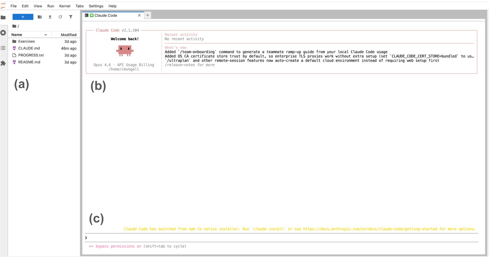
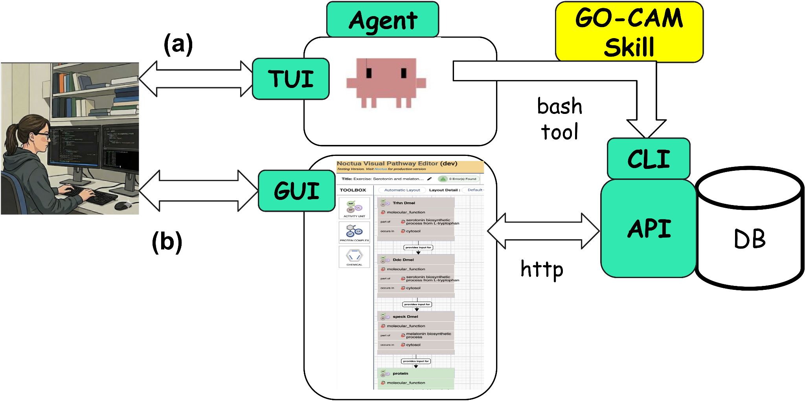

# GO AI Hub

The GO AI Hub gives every Gene Ontology curator a workspace in the browser with
Claude Code and GO's curation skills already set up. There is nothing to
install, and you don't need a subscription or an API key.

**Hub**: [ai.geneontology.org](https://ai.geneontology.org). Sign in with
GitHub. It is open to curators listed in GO's `users.yaml`, the same list as
Noctua.
**Repository**: [geneontology/go-jupyter](https://github.com/geneontology/go-jupyter)
**Paper**: Carbon, Moxon, Van Auken, Gaudet and Mungall,
[*Agents for Everyone: A Workshop Framework for Building Agentic AI Capabilities
in a Distributed Curation Community*](https://arxiv.org/abs/2608.27675)
(arXiv:2608.27675, 2026)

*A curator's workspace: files on the left, Claude Code in a terminal on the
right. From the paper.*

## How it started

The hub began as the environment for the GO agent training workshop in April
2026, where 37 curators worked up from chatting with an agent to repairing a
GO-CAM model. The [training materials](https://go.lbl.gov/go-agent-training/)
are online, and the paper describes the setup and what was learned. Its main
conclusion is that building agentic capability in a curation community is
mostly a matter of access, workflow design, and training.

The workshop introduced a way of working we now use widely. The agent edits a
GO-CAM model through the Noctua API while the curator watches, and corrects,
the same model in Noctua's own editor. See
[Shared control](../patterns/shared-control.md).

## What curators do with it now

After beta testing GO-CAM curation from July to September 2026, the hub is open
to all GO curators for any GO work. At the GO Consortium meeting in autumn
2026, curators reported on projects including:

* **Drafting GO-CAMs from summary figures.** The agent identifies the genes in
  a pathway figure from a paper or review. It fills the activities from
  existing annotations and reports where none exist, then compares the result
  with models of the same pathway in other species. The comparison exposed
  places where curators had been inconsistent, for example in cellular
  locations.
* **Reviewing and building GO-CAMs at scale.** In lipid transport, a batch of
  16 GO-CAMs was quality-checked in one sitting. The work also produced a new
  GO term, a new Rhea reaction, and UniProtKB updates. The curator still caught
  what the agent missed.
* **Full-paper curation for community validation.** At PomBase, an agent
  curates a whole paper (about 45 annotations per paper) for the author to
  check. In a pilot it came close to curator recall and accuracy.
* **Literature triage.** At FlyBase, an agent sorts newly published papers on
  under-annotated genes into tiers. On the clearest calls it matched a curator
  skimming the papers.
* **Phylogenetic annotation.** An agent prepared "deep research" reviews of
  gene families that lacked molecular function annotations, for PAINT curators
  to review.
* **Ontology editing.** Editors use the hub as well as GitHub to work on
  go-ontology with its skills.

Several of these groups ran into the same problems separately. Examples are
the agent's tendency to fall back on generic binding terms, and the need for a
clear rule on what counts as a relevant molecular function. A regular place to
share workflows would help.

## Skills

The hub's skills come from
[geneontology/go-skills](https://github.com/geneontology/go-skills) and
go-ontology. Every curator has an editable copy, so a curator can improve a
skill, try the change in their own session, and propose it for everyone. See
[Write your own skills](../how-tos/author-skills.md) and the hub notes in
[Writing and sharing skills](https://github.com/geneontology/go-jupyter#writing-and-sharing-skills).

## Run your own

go-jupyter contains no GO secrets and runs any JupyterHub you point it at. Its
README covers deploying one for your own community.
