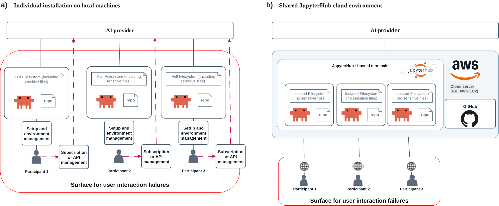
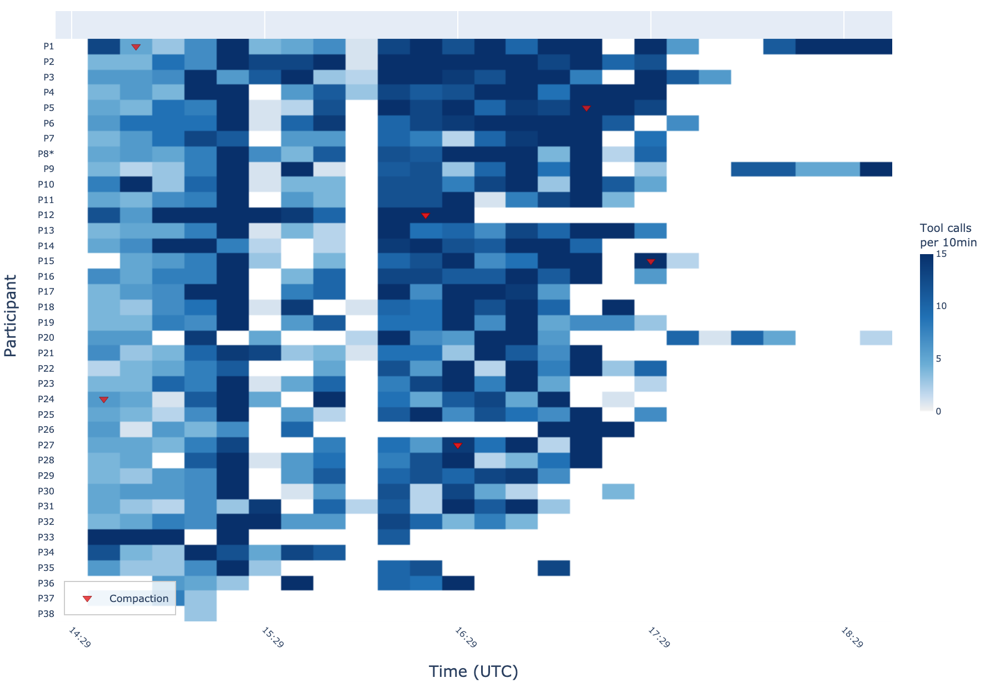

# GO AI Hub

A shared JupyterHub where every Gene Ontology curator gets their own workspace
with Claude Code, GO curation skills, and a terminal in the browser. There is
nothing to install and no API key to manage.

**Repository**: [geneontology/go-jupyter](https://github.com/geneontology/go-jupyter)
**Hub**: [jupyter.geneontology.io](https://jupyter.geneontology.io) (closed beta,
GitHub sign-in, open to curators listed in GO's `users.yaml`)
**Paper**: Carbon, Moxon, Van Auken, Gaudet and Mungall,
[*Agents for Everyone: A Workshop Framework for Building Agentic AI Capabilities
in a Distributed Curation Community*](https://arxiv.org/abs/2608.27675)
(arXiv:2608.27675, August 2026)

This page differs from the other case studies. go-jupyter is not a knowledge
base. It is the environment curators use to work on the knowledge bases, and it
is how most GO curators meet an agent for the first time.

## What a curator sees

*The workspace in a browser: (a) the file browser with the seeded files,
(b) Claude Code running in a JupyterLab terminal, (c) the box where the curator
types instructions. Figure 1 of the paper.*

You open the URL, sign in with GitHub, and land in a terminal. Press Enter to
start Claude, or T and Enter for a plain shell. Your home directory is a real Unix account
that no other curator can see. It holds:

* `~/go-skills`, a git checkout of
  [geneontology/go-skills](https://github.com/geneontology/go-skills). Claude's
  skills in `~/.claude/skills/` are links into it, so you have the GO-CAM
  (`noctua`, `save-to-drop-box`, `gocam-best-practice`), gene review, PubMed,
  UniProt and AmiGO skills from the first session.
* `~/go-ontology`, a sparse checkout of the GO edit files and their skills, for
  ontology editing.
* A `CLAUDE.md` that sets the agent's tone and ground rules, for example that
  Noctua edits go to the development server.
* `news/NEWS.md`, shown at the start of a session when something changed.

Signing in with GitHub also signs in the `gh` command, so `git push` and
`gh pr create` work without a second login.

## Why a shared hub

*(a) Each curator installs their own agent, manages their own subscription or
key, and gives the agent access to their whole laptop. (b) The hub: one server,
isolated workspaces, one shared credential, GitHub sign-in. The red outline is
the surface where things go wrong for a participant. Figure 2 of the paper.*

The paper's main finding is that building agentic capability in a community is
"primarily a problem of access, workflow design, and training". Several
workshop participants said they could not have installed Claude Code on their
institutional machines. On the hub they did not have to.

The isolation is also a safety property. A harness running on a curator's own
laptop can read and delete anything the curator can. On the hub it sees one
workspace.

## The agent and the curation tool, side by side

*The shared control ("sidecar") pattern. (a) The curator directs the agent in
the terminal; the agent uses the GO-CAM skill to drive the Noctua API.
(b) The curator watches and edits the same model in Noctua's own interface.
Figure 3 of the paper.*

This is the [Shared control](../patterns/shared-control.md) pattern. The agent
does not replace Noctua. It works alongside it, through the same API, so the
curator sees every agent edit in the interface they already know and can correct
it in place.

Curators found this the most relevant part of the workshop: 35 of 37
participants made at least one agent call to Noctua, and nine built entirely
new GO-CAM models that the exercises did not ask for.

## The first workshop in numbers

The workshop ran on 14 April 2026: 37 participants, four hours, four exercises
from "chat with the agent" to "fix a broken GO-CAM model".

| Measure | Value |
| --- | --- |
| Participants who finished all four exercises | 21 of 37 (57%) |
| Agent tool calls across 153 sessions | 5,816 |
| Tool calls that failed | 57 (1%), almost all self-corrected on the next try |
| Participants whose session hit context compaction | 32 of 37 (86%) |
| Total cost (server plus model use) | about $388 |

*Tool calls per ten minutes for each participant. Red triangles are context
compactions. The pale band is the live demonstration. From Appendix D of the
paper.*

## What works

**Nothing to install.** Access is the first barrier, and the hub removes it.
See [Harnesses](../reference/harnesses.md).

**Skills come from their own repository.** Skills are not written in
go-jupyter. Every home holds a clone of go-skills and links into it, and a timer
fast-forwards clean clones within minutes of a merge. A fix to a skill reaches
every curator without anyone reinstalling anything. See
[Break work into skills](../patterns/skills-before-automation.md).

**Curators can change the skills they use.** The clone in your home is yours.
Edit a skill on a branch and the change is live in your session at once; the
automatic update leaves a branch alone. Push it and open a pull request, and
once it is merged everyone has it. See
[Writing and sharing skills on the hub](https://github.com/geneontology/go-jupyter/blob/main/docs/writing-skills.md).

**Lookups instead of memory.** The second most used tool in the workshop, after
the shell, was the Ontology Lookup Service. Curators reached for it on their
own. See [Make identifiers hard to fake](../patterns/ground-identifiers.md).

## What to copy first

If you run a curation community and want people to try agents, copy the shape,
not the AWS details: one hosted environment, sign-in with an account people
already have, a central key with a spending cap (the workshop used a Google
Cloud budget enforcer on Vertex AI), and a starter `CLAUDE.md` with
three or four exercises built on tasks your curators already do. The README in
[go-jupyter](https://github.com/geneontology/go-jupyter) walks through deploying
your own.

## Gaps

**Silent fallback.** In one exercise the PubMed tool failed to authenticate for
some users. The agent switched to another API that returned truncated results,
then filled the missing abstracts in from its own training data without saying
so. Many curators noticed the abstracts were wrong. Lookup tools alone are not
enough; check outputs deterministically before they leave the session. See
[Fast and slow validation](../patterns/fast-and-slow-validation.md).

**Red text alarms people.** Agents try a command, get an error, and correct
themselves. Curators see the error, not the recovery, and conclude something is
broken. Say this in your training before the first session.

**Long sessions degrade.** Most participants hit context compaction. Start a
fresh session (`/clear`) between unrelated tasks.

**Workshop mode is permissive.** The hub runs Claude Code without permission
prompts and on a shared key, which is reasonable on a disposable host with
trusted participants. go-jupyter's README explains what to change for anything
else.

**The ontology toolchain is not there yet.** `robot` and the ODK `make` targets
cannot run on the hub, so ontology QC and reasoning happen in go-ontology's CI on
the pull request.
